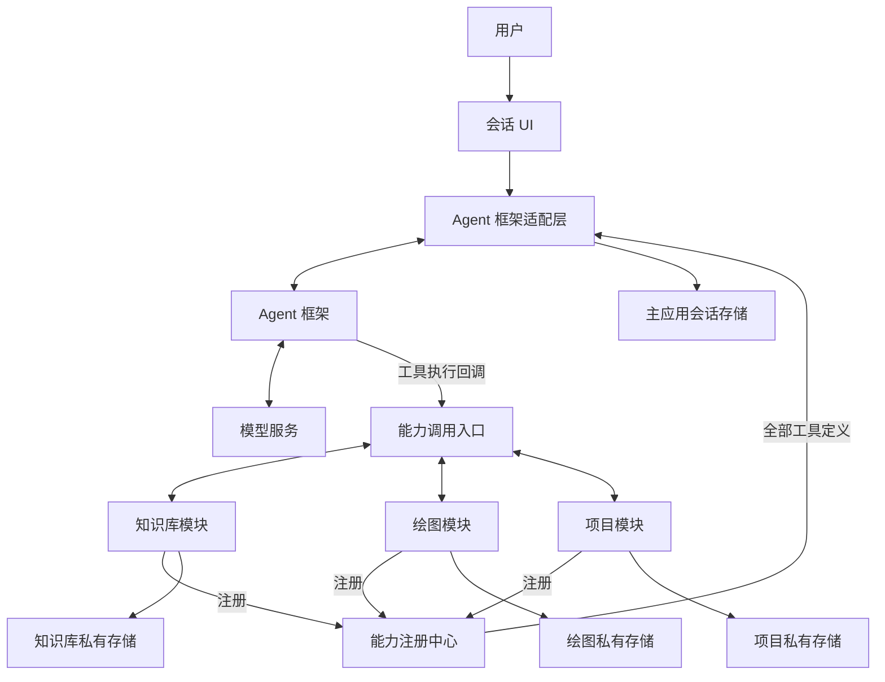

# Agent 主应用与能力模块架构设计

版本：0.1  
日期：2026-10-01  
状态：架构边界已确认，技术选型与具体 API 待实现阶段确定

## 1. 设计目标与已确认约定

构建类似 Cherry Studio 的 AI 聚合应用，以普通 Agent 会话作为主入口。独立子模块向主应用注册能力，Agent 在会话中使用这些能力完成任务。模块可以具有独立 UI、配置和数据，也可以仅提供工具。

以下约定是本设计的前提，后续实现不得通过框架默认值或基础服务绕过这些边界：

1. 主应用接入现成 Agent 框架，由框架管理模型对话、工具调用循环和自然结束行为。应用不额外设置最大步骤数、执行时间上限、费用预算或类似的会话硬限制；框架选型和接入时也不得无意保留这些硬限制。
2. 每次模型请求提供全部已启用、成功注册的公开能力定义。不实现能力搜索、相关性筛选、按需工具加载或会话级工具子集。
3. 主应用与各模块的私有数据互相隔离。跨边界数据访问只能使用所有者明确提供的能力接口，或接收一次调用显式传入、返回的数据。
4. 模块可以共享约定的基础配置与基础服务，同时拥有自己独立的配置、业务逻辑、数据库和文件资源。
5. 模块的内部实现不因被加载而成为公开接口。没有注册数据读取能力，就不能从外部读取其私有数据。

“全量能力”指工具名称、描述和输入结构等接口信息，不包含模块数据库、配置值、文件正文或实现代码。模型及服务商自身的上下文容量、连接错误属于外部运行条件，不由宿主转换成额外的执行预算策略。

## 2. 第一阶段范围

### 2.1 包含

- 桌面主应用、普通 Agent 会话与会话持久化。
- 内置可信模块的注册、启用、停用及构建时增删。
- 全量工具定义接入 Agent 框架。
- 模块独立页面、设置页、结果展示组件的可选注册。
- 公共基础配置与模块私有配置。
- 独立数据存储和显式能力接口访问。
- 模块运行状态、工具执行状态、取消及错误展示。

### 2.2 暂不包含

- 第三方插件市场、插件下载、运行时安装与更新。
- 不可信代码沙箱、独立权限审批系统。
- 每个模块单独运行一个 Agent、多 Agent 调度。
- 自研规划器、自研工具调用循环、独立工作流编排引擎。
- 工具检索、工具集合裁剪、费用预算和执行步数限制。
- 自动读取模块数据、自动把模块数据加入会话记忆。
- 跨设备同步、云服务部署和远程模块发现。

预留稳定的模块接口即可，第一阶段不为以上扩展提前实现完整基础设施。

## 3. 总体架构



| 层 | 职责 | 边界 |
| --- | --- | --- |
| 应用宿主 | 窗口、导航、工作区、模块加载、页面挂载 | 不实现模块业务，不直接查询模块数据 |
| Agent 框架适配层 | 模型接入、全量工具转换、会话事件和结果映射 | 不自行规划任务或接管执行循环 |
| Agent 框架 | 对话、工具选择、多轮调用、回答生成 | 通过注册的执行回调调用能力 |
| 能力注册中心 | 元数据、版本、提供方和状态 | 不存放模块私有数据 |
| 能力调用入口 | 定位处理器、校验参数、路由结果与取消信号 | 是确定性调用通道，不是第二个 Agent |
| 功能模块 | 工具实现、业务逻辑、私有数据和配置、可选 UI | 对外只暴露已注册能力和声明的 UI 贡献 |
| 基础服务 | 公共配置、凭据、日志、平台适配、存储机制 | 提供机制，不能成为跨模块读取数据的旁路 |

模型生成工具调用请求，实际执行由应用代码完成。能力调用入口可由 Agent 框架的执行回调直接使用，不要求额外建立一个调度服务。

## 4. 会话执行模型

### 4.1 执行流程

1. 用户在会话 UI 中提交消息。
2. 主应用取出该会话的数据，交给 Agent 框架。
3. 框架适配层取得全部可用能力，转换为当前模型支持的工具格式。
4. 框架向模型提交会话和完整工具集合。
5. 模型返回文本或工具调用请求。
6. 框架执行回调通过能力调用入口调用所属模块。
7. 模块返回结果，框架将其作为工具结果加入后续模型请求。
8. 框架按自身的对话机制继续执行，直至本次运行结束或用户主动取消。
9. 主应用持久化会话消息、工具调用记录及本次明确返回的结果。

宿主不在循环外增加步数、计时、费用判断，也不根据工具结果自行生成下一项业务任务。显式工作流若未来需要，应作为独立能力设计。

### 4.2 框架适配边界

适配层只需要提供以下概念性操作，名称不绑定特定 SDK：

- `startConversation`：提交会话、模型配置、完整工具集合，接收框架运行事件。
- `cancelConversation`：转发用户取消信号。
- `toFrameworkTool`：将内部能力定义转为框架工具，绑定调用入口。
- `toConversationEvent`：统一文本、工具调用、结果、错误和结束事件。

适配层必须保持工具调用 ID、参数、结果和消息关系，不应通过重新解析模型自然语言来模拟工具调用。模型连接应支持目标框架的工具调用机制；不支持时明确显示连接不兼容。

框架选型需要验证全量工具接入、取消、消息持久化、工具结果类型及无需上述硬限制的执行模式。文档中的接口仅用于表达契约，不代表已选定框架的真实 API。

## 5. 模块协议

模块的公开边界由以下部分组成：

| 部分 | 必需 | 内容 |
| --- | --- | --- |
| 身份声明 | 是 | 模块 ID、名称、版本、所需宿主协议版本 |
| 生命周期 | 是 | 初始化、激活、停用、资源释放 |
| 能力声明 | 否 | 工具契约及对应处理器，可以为空 |
| 私有配置定义 | 否 | 默认值、Schema、迁移、设置 UI |
| UI 贡献 | 否 | 导航、页面、设置页和工具结果展示组件 |
| 私有存储 | 否 | 模块自己的数据库、文件、数据迁移 |

纯工具模块不需要页面。纯界面模块也可以没有 Agent 能力。

示意协议如下。`JsonSchema`、`JsonValue`、`ToolResult` 是模块 SDK 定义的跨进程可序列化类型：

```ts
interface CapabilityDefinition {
  id: string
  name: string
  version: string
  description: string
  inputSchema: JsonSchema
  outputSchema?: JsonSchema
}

interface ToolExecutionContext {
  invocationId: string
  signal: AbortSignal
}

interface ToolRegistration {
  definition: CapabilityDefinition
  execute(
    input: JsonValue,
    context: ToolExecutionContext
  ): Promise<ToolResult>
}

interface RuntimeModule {
  id: string
  version: string
  activate(context: ModuleContext): Promise<ModuleActivation>
}

interface ModuleActivation {
  tools: readonly ToolRegistration[]
  deactivate(): Promise<void>
}
```

`ModuleContext` 只提供所属模块的存储、配置、基础服务句柄及公开能力调用入口，不包含主应用会话库、其他模块配置或其他模块数据库。

工具执行上下文中的调用 ID 用于关联记录，取消信号用于响应用户操作。不会自动把完整会话、用户目录、主应用状态或其他模块数据注入模块。

## 6. 能力注册与调用

### 6.1 身份与命名

- 模块 ID 必须稳定且全局唯一，例如 `knowledge`、`image`。
- 内部能力 ID 使用模块命名空间，例如 `knowledge/search`。
- 提交给模型的工具名称采用兼容格式，例如 `knowledge__search`；实际格式由模型适配器检查。
- 注册中心保存能力版本和宿主协议版本，不依赖展示名称识别接口。
- 具有相同业务用途的不同模块仍使用不同工具名称，其描述明确来源和区别。由模型或用户的明确指令选择，不设置隐式“第一个提供方”。

### 6.2 注册过程

1. 宿主根据明确的内置模块清单加载模块。
2. 检查模块 ID、协议兼容性和启用状态。
3. 模块初始化自己的配置及存储。
4. 模块返回公开能力集合，宿主校验名称、输入 Schema 和处理器。
5. 该模块的能力作为一个整体注册；失败时撤销本次注册并释放资源。
6. 注册成功后，将模块状态设为可用，同时挂载其 UI 贡献。

框架只能取得可序列化能力描述。执行函数和模块私有对象保留在运行层，不发送给模型，也不直接暴露给 renderer。

### 6.3 全量提供规则

每次模型请求包含当时全部已启用且注册成功的能力。模块停用、故障或尚未成功注册时不属于可用集合，这属于生命周期处理，不是相关性筛选。

模块注册中心发生变化后，后续模型请求刷新工具集合。框架若不支持运行中更新，则在下一次运行生效；调用入口仍检查实际状态，阻止旧工具引用执行已停用模块。

不把工具结果或模块数据预先加入上下文。不因工具较多而静默移除工具；若模型服务无法接收完整集合，明确报告兼容性问题。

### 6.4 调用入口

统一提供 `invoke(capabilityId, input, invocationContext)`，负责：

- 查找当前有效的能力注册。
- 校验输入，构造所属模块的调用上下文。
- 执行处理器，转发取消与必要的进度事件。
- 校验声明了输出 Schema 的结果，统一错误结构。
- 将结果返回给框架或其他明确调用者。

不增加模型推理、不修改会话工具范围、不直接访问模块存储，也不自动重试所有修改操作。

其他模块确有协作需求时，也使用同一公开能力入口。调用方依赖公共契约，不能导入提供方内部服务。人工 UI 调用能力可以直接执行，无需再次经过模型。

## 7. 数据隔离与显式共享

### 7.1 所有权

| 数据 | 所有者 | 外部访问方式 |
| --- | --- | --- |
| 会话、消息、工具交互记录 | 主应用 | 只有显式传参或主应用未来公开的能力 |
| 文档、索引、知识库配置 | 知识库模块 | 该模块注册的检索、读取等能力 |
| 生成记录、图片文件 | 绘图模块 | 该模块注册的生成、查询、读取等能力 |
| 项目和项目附件 | 项目模块 | 该模块注册的项目能力 |
| 模块私有设置 | 所属模块 | 模块自己的 UI 或明确公开的配置能力 |
| 约定共享的配置 | 基础配置服务 | 受明确契约约束的基础服务接口 |

主应用无权通过加载模块自动枚举其数据。模块也不能自动读取主应用历史会话或其他模块状态。

第一阶段采用工程隔离：独立存储、作用域化服务句柄、公共接口和依赖检查。内置模块是可信代码；同一进程中的约定不构成抵御恶意代码的安全沙箱。未来加载不可信模块时再增加运行环境隔离。

### 7.2 存储布局

建议每个所有者使用独立数据库与文件目录：

```text
app-data/
  foundation/                 约定共享的基础配置和凭据
  main/
    conversations.sqlite      主应用会话及工具交互记录
    attachments/              主应用拥有的附件副本
  modules/
    knowledge/
      data.sqlite
      settings.json
      files/
    image/
      data.sqlite
      settings.json
      files/
```

基础存储服务可以管理连接、目录创建、备份机制，但传给业务代码的句柄必须作用域化。不提供跨模块 `getDatabase(moduleId)`、全局文件枚举或私有配置查询接口。

### 7.3 数据通过能力返回

小数据可以直接返回结构化结果。大文件、图片和音频可以返回所属模块的资源引用：

```json
{
  "kind": "resource-reference",
  "ownerModuleId": "image",
  "resourceId": "img_123",
  "mediaType": "image/png",
  "summary": "生成的宣传图"
}
```

资源引用仅用于标识，不授予读取权。模块可注册 `image/read` 来读取内容；没有对应能力时，主应用只能展示已返回的标识和摘要。不得用全局文件服务、内部路径或可直接读取私有文件的 URL 绕过这一规则。

生成接口也可以直接返回展示所需内容，这同样属于显式接口返回。工具结果以 JSON 元数据、文本和框架支持的内容块映射；二进制跨进程传输由平台适配处理，不假定框架能接收任意对象。

### 7.4 会话持久化与资源副本

主应用可以保存已经返回的文本、工具结果和资源引用。这是本次交互获得的数据副本，不是对模块原始数据的持续访问。

需要离线查看完整媒体时，先通过模块公开能力取得内容，再保存到主应用自己的附件目录。仅保存资源引用时，模块停用或原资源删除后可能无法再次读取，应显示资源不可用，不能扫描模块目录补救。

跨模块保存也遵循相同规则：项目模块获得资源引用后，必须通过来源模块的公开读取能力取得内容，或接收调用参数明确携带的内容，再创建自己的副本。不得转为直接访问来源文件路径。

## 8. 配置设计

### 8.1 配置范围

| 范围 | 示例 | 所有者 |
| --- | --- | --- |
| 公共基础配置 | 主题、语言、代理、服务商连接和凭据引用 | 基础配置服务 |
| Agent 配置 | 主会话模型、系统提示、框架所需连接配置 | 主应用 |
| 模块配置 | 绘图模型、默认尺寸、知识库检索设置 | 所属模块 |
| 本次调用参数 | 提示词、目标知识库、项目 ID | 调用请求 |

主会话模型和模块执行任务所用模型可以不同。基础模型连接服务只在接口契约范围内提供连接能力，不暴露其他模块正在使用的私有配置。

主应用只维护模块启用状态等宿主自身配置。模块自己的设置 UI 负责读取和修改私有设置；宿主仅挂载页面，不自动加载这些设置值。

### 8.2 继承规则

对明确允许继承的字段，优先级为：本次调用值 > 模块显式设置 > 公共默认值 > 模块内置默认值。

每个字段自行声明是否允许覆盖，不做任意对象的全局深度合并。使用“继承公共默认”与“固定模块值”两种显式状态，公共默认变化只影响前者。

模块独立维护配置 Schema、默认值、配置版本及迁移。凭据通过基础服务句柄使用，工具定义和模型参数中不出现密钥。

共享 UI 基础配置如主题属于约定的公共信息，不因此开放模块私有配置访问。若需要让 Agent 修改某项模块设置，应由该模块主动注册对应能力。

## 9. UI 模块化

宿主提供导航、工作区、设置入口和会话结果扩展位置，模块声明自己贡献的内容。新增模块时不修改宿主中的模块专属条件分支。

共享组件库提供颜色、字体、间距、按钮、表单和基础布局；模块的专业页面采用局部样式，避免全局 CSS 干扰其他模块。

每个模块可提供：

- 页面：知识库管理、绘图画布等专业交互。
- 设置面板：由模块自行访问和修改所属配置。
- 工具结果展示组件：渲染本次公开返回的工具结果。

同一业务服务供模块 UI 和能力处理器复用。模块自己的 UI 可以访问所属私有业务服务；跨模块 UI 或宿主仍必须走公开能力接口。

结果组件只得到本次返回的展示数据。组件若需要追加读取，必须执行所属模块已公开的数据能力；不得以 renderer 组件身份获得隐式的跨边界读权限。

主会话展示文本、工具名称、执行状态、参数及公开结果。调试日志不采集完整私有数据库、密钥或未公开配置。

## 10. 生命周期与错误处理

### 10.1 状态

```text
disabled → activating → active → deactivating → disabled
                   ↘ failed
```

- `disabled`：没有可用工具，UI 贡献未挂载。
- `activating`：初始化模块配置、存储和处理器。
- `active`：工具已注册，允许调用。
- `deactivating`：已停止接收新调用，处理尚在运行的请求。
- `failed`：初始化或运行基础设施失败，显示原因并移除不可用注册。

一次普通工具失败不会自动使整个模块进入 `failed`；只有模块运行基础设施确实不可用时才撤销注册。

### 10.2 停用及移除

停用顺序：拒绝新调用 → 撤销工具注册 → 对执行中请求传递取消信号 → 等待处理器结束并释放资源 → 卸载 UI 贡献。

处理器应支持协作取消。无法中断的底层操作保持“正在停用”状态，直到实际结束；不假定取消信号能够立即终止所有代码，也不为此增加执行时间硬限制。

停用不删除业务数据。第一阶段的代码移除在开发和构建阶段完成；清除数据是独立、明确的用户操作。重新启用时读取已有配置及数据，并执行所属模块的迁移。

### 10.3 错误

统一错误至少包括：`CAPABILITY_UNAVAILABLE`、`INVALID_INPUT`、`RESOURCE_NOT_FOUND`、`EXECUTION_FAILED`、`CANCELLED`。

错误包含调用 ID、公开消息及是否可重试等结构信息。详细内部错误留在所属运行层，不把密钥、私有路径或内部数据自动返回模型。

只读操作可按实现需要重试；创建、保存、删除等操作由模块定义幂等行为，并关联调用 ID。不得自动重试全部修改操作。

用户取消会话时，将信号沿框架、调用入口传递到模块。框架得到结构化工具失败或取消结果，不把失败转换为成功产物。

## 11. 代码组织与依赖方向

建议使用 workspace 将模块和基础组件分包。以下是实现结构建议，不代表目录已初始化：

```text
apps/
  desktop/
    src/
      main/                   Electron 主进程及运行入口
      preload/                有类型的受限 IPC 桥接
      renderer/
        shell/                导航、工作区和模块 UI 挂载
        conversation/         会话 UI
      composition/            内置模块清单与组合根

packages/
  module-sdk/                 纯契约、Schema 类型和模块上下文
  module-host/                生命周期和能力注册
  agent-adapter/              Agent 框架及模型工具适配
  foundation/                 基础配置、凭据、平台及作用域存储机制
  ui/                         共享 UI 组件

modules/
  knowledge/
    manifest.ts               不含私有配置值的模块身份和 UI 描述
    contracts/                可供调用方依赖的公开能力契约
    runtime/                  初始化、能力注册、业务服务
    storage/                  私有存储及迁移
    settings/                 私有配置 Schema 和迁移
    ui/                       页面、设置及结果组件
    index.ts                  受控公开入口
  image/
  project/
```

依赖规则：

1. 模块只依赖 SDK、约定的基础服务、UI 组件及必要的公共能力契约。
2. 模块之间不导入私有实现，协作通过能力调用入口。
3. 基础包不导入业务模块。
4. 宿主只通过组合根导入模块公开入口，不引用模块私有数据库或配置实现。
5. UI 代码不导入 Node、数据库驱动或模块运行层；平台能力经类型化 IPC 调用。
6. 共享契约包不引入应用框架运行实例、数据库连接或私有对象。

工具运行层、凭据与数据库连接位于桌面运行进程。耗时且会阻塞事件循环的任务可移到 worker 或独立进程；处理器对外仍保持相同能力契约。运行入口不能加载 React 组件，UI 入口不能加载数据库代码。

通过包导出和 lint 依赖检查落实上述约定，不能仅依靠目录命名。添加模块的预期改动范围是新增模块包、依赖声明和组合根注册，不修改 Agent 循环和宿主业务分支。

## 12. 技术选型建议

已确认的是架构和行为；具体库及版本未确定。

| 部分 | 建议基线 | 选型关注点 |
| --- | --- | --- |
| 桌面 | Electron | 本地工具接入、类型化 IPC 和页面隔离 |
| UI | React + TypeScript | 模块页面、结果组件、共享设计规范 |
| 工程 | pnpm workspace | 包边界和内置模块组合 |
| Agent | 现成 Agent 框架 | 普通会话、完整工具集合、取消及无额外硬限制 |
| 数据库 | 独立 SQLite 数据库 | 主应用与模块分别拥有存储和迁移 |
| 校验 | 可生成 JSON Schema 的校验库 | 开发类型和运行时输入、输出检查 |

Agent 框架是可替换的适配对象。模块协议不直接导出某个框架的 `Tool` 类型，避免模块与框架版本绑定。

外部工具接入可在后续通过 MCP 适配成同一种能力注册。MCP 不替代应用自己的模块 UI、配置和生命周期协议。

## 13. 典型协作示例

用户请求：“检索知识库中关于产品 A 的资料，生成宣传图并保存到项目 B。”

1. Agent 从全量工具描述中选择 `knowledge__search`。
2. 知识库返回产品资料片段和来源；未返回的文档仍留在模块内部。
3. Agent 根据资料调用 `image__generate`，绘图模块使用自己的模型与配置。
4. 绘图模块返回图片引用及摘要。
5. Agent 调用 `project__add_asset`。项目模块通过公开读取能力取得图片，或接收已显式取得的内容，并保存自己的副本。
6. 项目模块返回保存结果。Agent 根据真实结果回复用户。

如果绘图模块没有公开读取能力、生成接口也没有返回内容，主应用及项目模块只能持有引用，不能自行读取图片。Agent 应说明无法完成保存的原因。

执行先后由 Agent 框架与模型处理，宿主不为该示例硬编码专用流程。

## 14. 实施顺序与验收

### 14.1 实施顺序

1. 确定 Agent 框架并验证普通会话及完整工具集合，检查默认配置不会引入已排除的硬限制。
2. 建立 SDK、模块宿主、组合根、独立存储和公共基础配置。
3. 实现两个简单模块，验证全量工具注册、调用及结果进入会话。
4. 加入知识库、绘图和项目资源能力，验证跨模块数据传递。
5. 接入模块独立页面、设置和会话结果组件。
6. 验证停用、取消、错误、迁移和构建时移除。

### 14.2 验收标准

- 新增模块并注册能力后，主 Agent 可以使用它，无需新增宿主业务分支。
- 每次请求包含全部可用工具，不存在隐式筛选或工具子集。
- 主应用没有额外的步骤、时间和费用上限，所选框架的接入配置符合该行为。
- 没有读取能力的模块，其私有数据不会自动出现在会话、模型上下文或全局查询接口中。
- 模块只能获取显式调用参数，不能自动取得完整主会话或其他模块设置。
- 资源引用不能绕过能力接口变成直接文件访问。
- 主应用保存已返回的结果与模块内部原始数据相互独立。
- 修改公共默认配置只影响明确继承的模块字段。
- 停用后新调用返回明确错误，执行中任务取消及资源释放行为可观察。
- 从组合根和构建依赖中移除一个模块后，其余应用仍可构建、启动和使用。
- UI 手动操作与 Agent 调用复用业务服务，结果一致。
- 包导出和依赖检查阻止跨模块私有实现导入。

工具契约、状态和隔离可以用确定性测试验证；Agent 的工具选择及多步任务成功率另外使用实际会话案例验证，不将模型的一次正确调用视为架构验收完成。

## 15. 待确定事项

- 具体 Agent 框架、模型适配 SDK 及版本。
- 第一批业务模块及其工具输入、输出契约。
- 会话媒体采用保留引用还是取得内容后保存副本的默认行为。
- UI 组件库、模块页面布局和持久化库。
- 是否最终采用建议的 Electron 实现基线。

以上选择不改变已经确认的三项边界：框架管理普通 Agent 会话、全量提供能力定义、私有数据仅经显式接口共享。

## 16. 参考资料

- [Cherry Studio 架构说明](https://github.com/CherryHQ/cherry-studio/blob/main/docs/references/architecture/README.md)：桌面运行层、UI、基础服务与业务边界的参考。
- [AI SDK 工具调用](https://ai-sdk.dev/docs/ai-sdk-core/tools-and-tool-calling)：工具定义、执行回调与多轮调用的参考；不代表本项目已选择该框架或采用其默认限制。
- [MCP 服务端能力](https://modelcontextprotocol.io/docs/learn/server-concepts)：后续外部能力适配的参考。
- [Electron 安全指南](https://www.electronjs.org/docs/latest/tutorial/security)：桌面运行层与 renderer 边界的参考。
